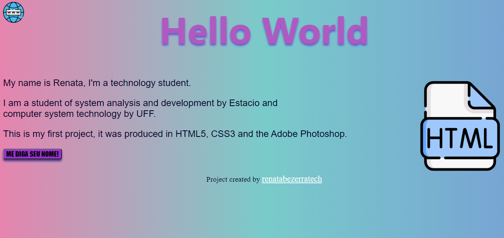

# Hello-World-RSB

 Este é meu primeiro exercício. 

<h4 align="center"> 
	🚧  Exercício 🚀 Finalizado...  🚧
</h4>

### 🛠 Tecnologias

As seguintes ferramentas foram usadas na construção do projeto: HTML5, CSS3 e Adobe Photoshop.

Autora: Renata Silva Bezerra

